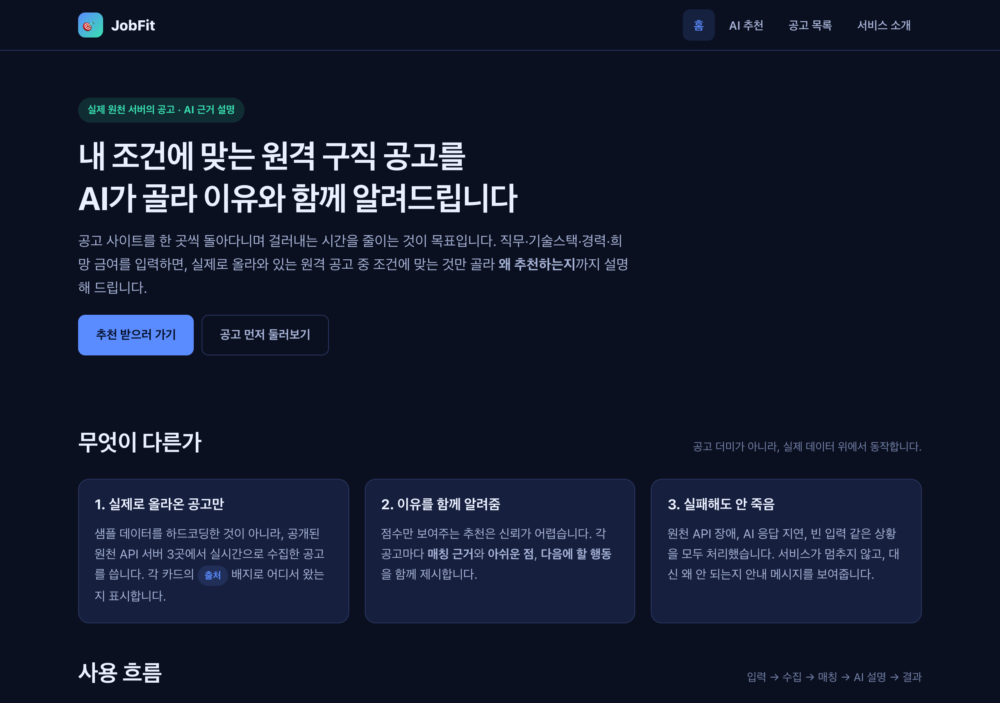
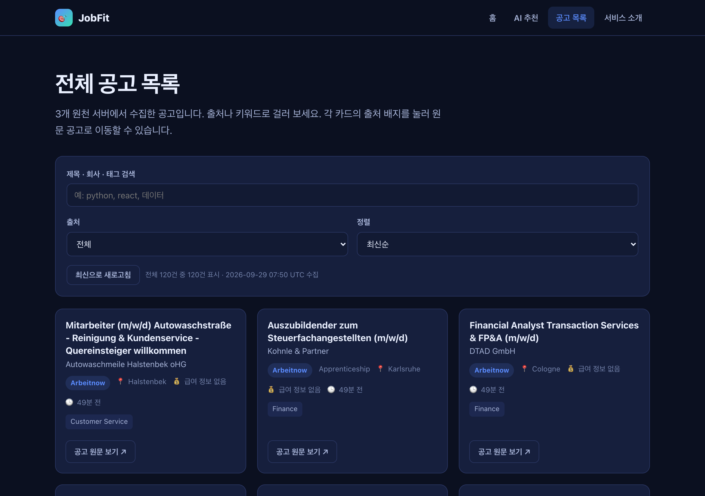
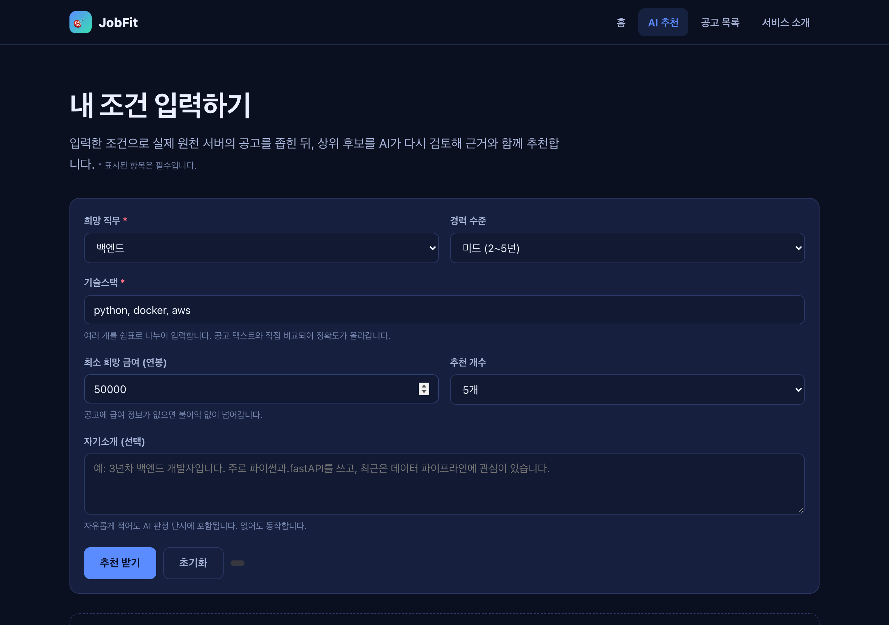
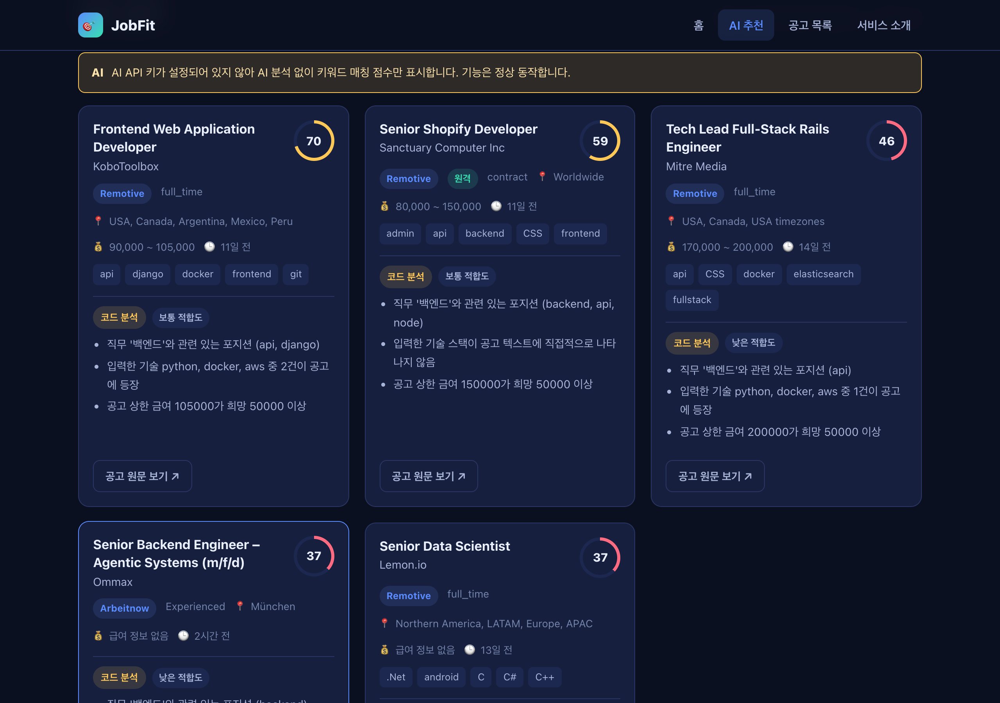
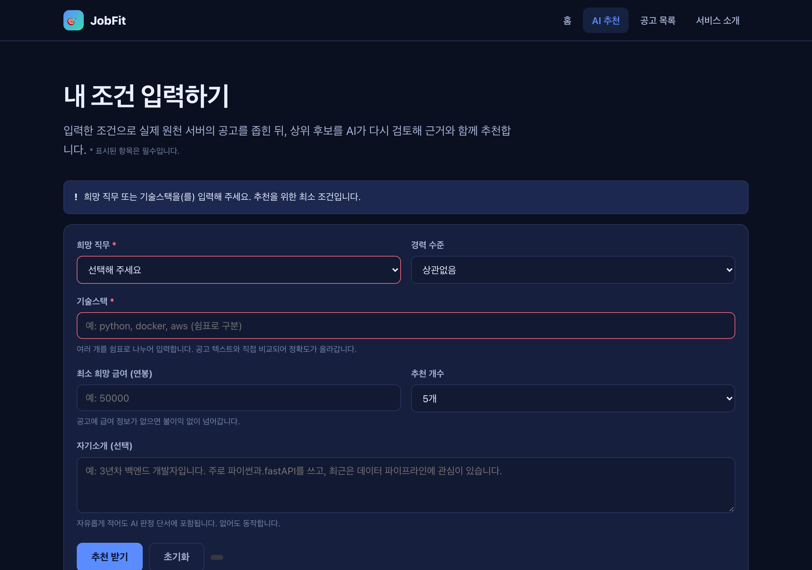
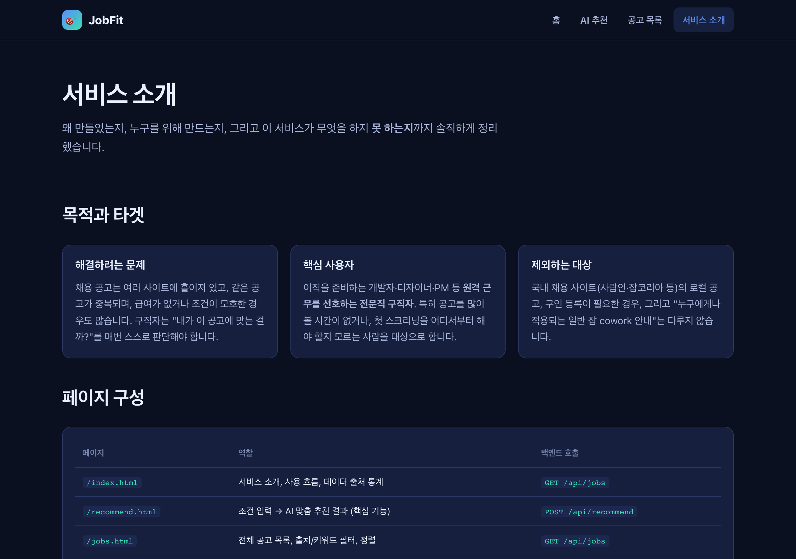
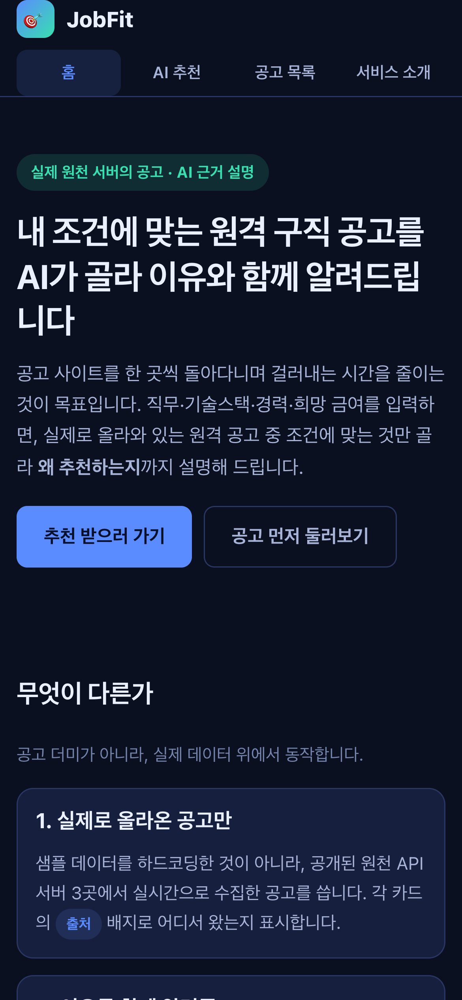
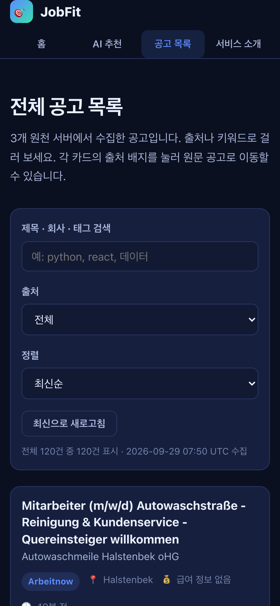
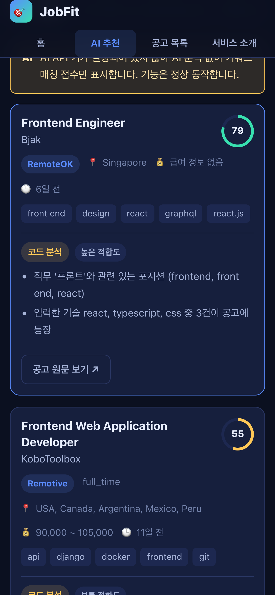

# 증빙 자료 — 스크린샷

> 수집일: 2026-09-29 · 환경: 로컬 개발 서버 (`python3 dev_server.py`, http://localhost:8000)
> 수집 도구: Playwright (시스템 Chrome) — `scripts/capture-screenshots.js`
> 데이터는 수집 시점의 실제 원천 서버 응답입니다.

---

## 데스크톱 (1280 × 900)

### 1. 홈 — 서비스 소개


- 서비스 한 줄 정의, 핵심 차별점 3가지, 사용 흐름 5단계 표
- 하단 "데이터 출처" 영역에 **실시간 수집 건수**가 표시됨
  (RemoteOK / Remotive / Arbeitnow 각 출처별 카운트)

### 2. 공고 목록 — 필터 · 검색 · 정렬


- 원천 서버에서 수집한 공고 카드 목록
- 각 카드에 **출처 배지**, 원격 여부, 지역, 급여, 게시 시각, 태그 표시
- 상단에서 출처 필터 / 키워드 검색 / 정렬(최신·급여·회사명) 제공
- 목록 하단에 "전체 N건 중 M건 표시 · 수집 시각" 표기

### 3. AI 추천 — 입력 폼


- 희망 직무(필수), 경력 수준, 기술스택(필수), 최소 희망 금여, 추천 개수, 자기소개
- 각 입력 항목에 설명 힌트가 함께 제공

### 4. AI 추천 — 결과 (핵심 기능)


- 입력: **백엔드 / python, docker, aws / 미드 / 희망 50000**
- 각 공고 카드에 **적합도 점수(0~100, 색상 원형 표시)**, 매칭 근거 목록,
  아쉬운 점, 다음 행동 제안
- 상단에 "전체 133건 중 N건을 추천합니다 · AI 판단 M건" 표기
- AI 상태를 배지로 투명하게 공개
  (`AI 분석 적용됨` / `코드 분석으로 대체됨` / `AI 미연동 상태`)

### 5. 실패 처리 — 빈 입력


- 필수값이 비어 있어 제출하면 **400 응답**을 받음
- 안내 메시지: "희망 직무 또는 기술스택을(를) 입력해 주세요"
- 해당 입력 칸에 **빨간 테두리**가 표시되어 무엇을 고쳐야 하는지 즉시 알림

### 6. 서비스 소개


- 목적과 타겟 사용자 / 다루지 않는 대상
- 페이지 구성표, AI 기능 정의(입력·출력·처리 순서)
- **실패 처리 기준표 10개 항목**
- 기술적 한계(캐시 휘발성, 국내 공고 미포함, 비-IT 공고 혼재 등)

---

## 모바일 (390 × 844)

### 7. 홈 — 모바일


- 카드 그리드 1열, 내비게이션 2줄 전환
- **가로 스크롤 없음** 확인

### 8. 공고 목록 — 모바일


- 공고 카드가 화면 폭에 맞춰 1열로 쌓임
- 점수 표기·배지가 축소된 레이아웃으로 적용

### 9. AI 추천 결과 — 모바일


- 입력: **프론트 / react, typescript, css**
- 데스크톱과 동일한 점수·근거·행동 표시가 모바일에서 정상 동작

---

## 확인된 반응형 기준

| 화면 크기 | 카드 열 | 폼 열 | 가로 스크롤 |
| --- | --- | --- | --- |
| 1280 × 900 | 3열 | 2열 | 없음 |
| 390 × 844 | 1열 | 1열 | 없음 |

브레이크포인트는 `768px` 와 `480px` 두 곳입니다.
(`css/style.css` 의 `@media` 규칙 참조)

---

## 재수집 방법

```bash
# 1) 서버 실행 (별도 터미널)
python3 dev_server.py

# 2) 의존성 설치
npm i -D playwright

# 3) 캡처
node scripts/capture-screenshots.js
```

> 참고: 기본적으로 뷰포트 크기로 캡처한다.
> 항목이 수십 개 많은 목록 페이지를 통째로 담으면 파일이 수 MB 까지 커지고
> 증빙으로서 오히려 읽기 어려워지기 때문이다.
> 전체 페이지가 필요한 경우 `shoot(page, "파일명.png", { fullPage: true })` 로 전환한다.
